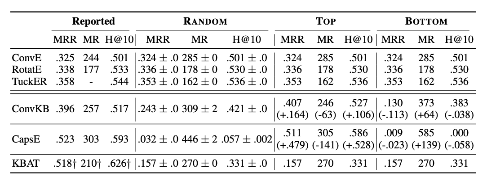

## A Re-evaluation of Knowledge Graph Completion Methods

[](https://acl2020.org/)
[](https://arxiv.org/abs/1911.03903)
[](https://shikhar-vashishth.github.io/assets/pdf/kg_reeval_supp.pdf)

Source code for [ACL 2020](http://acl2020.org) paper: [A Re-evaluation of Knowledge Graph Completion Methods](https://arxiv.org/abs/1911.03903). 

*Effect of different evaluation protocols on recent KG embedding methods on FB15k-237 dataset. For
TOP and BOTTOM, we report changes in performance with respect to RANDOM protocol. Please refer to paper for more details.* 


### Dependencies

- Compatible with TensorFlow 1.x, PyTorch 1.x, and Python 3.x.
- Dependencies can be installed using `requirements.txt`.

### Usage:

* Codes for different models are included in their respective directories.
* Run `proproc.sh` for unziping the data.


### Citation:
Please cite the following paper if you use this code in your work.

```bibtex
@ARTICLE{kgeval,
       author = {{Sun}, Zhiqing and {Vashishth}, Shikhar and {Sanyal}, Soumya and
         {Talukdar}, Partha and {Yang}, Yiming},
        title = "{A Re-evaluation of Knowledge Graph Completion Methods}",
      journal = {arXiv e-prints},
     keywords = {Computer Science - Computation and Language},
         year = "2019",
        month = "Nov",
          eid = {arXiv:1911.03903},
        pages = {arXiv:1911.03903},
archivePrefix = {arXiv},
       eprint = {1911.03903},
 primaryClass = {cs.CL},
       adsurl = {https://ui.adsabs.harvard.edu/abs/2019arXiv191103903S},
      adsnote = {Provided by the SAO/NASA Astrophysics Data System}
}
```

For any clarification, comments, or suggestions please create an issue or contact [Zhiqing](https://www.cs.cmu.edu/~zhiqings/) or [Shikhar](http://shikhar-vashishth.github.io).
